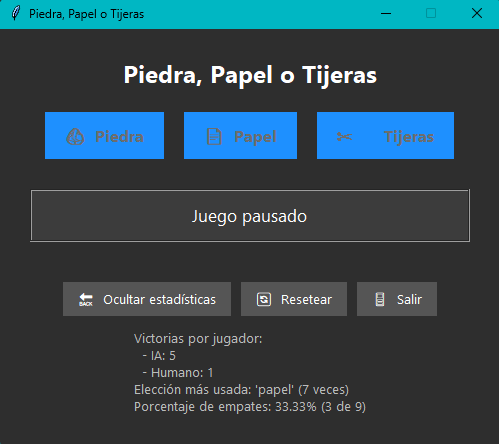
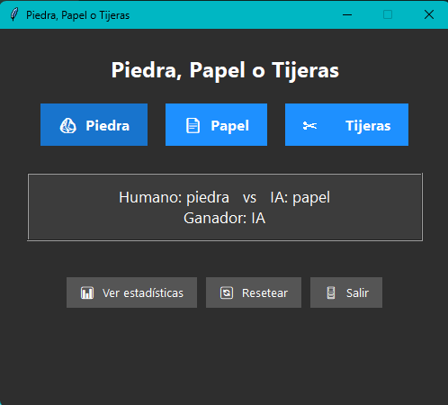
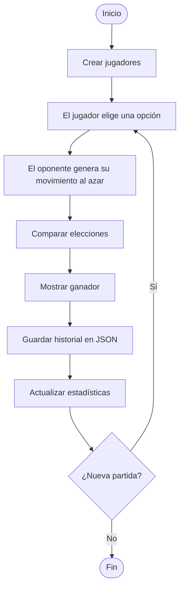

<div align="center">

# Piedra, Papel o Tijeras


El juego clásico **Piedra, Papel o Tijeras** en Python, construido como un ejercicio de **ingeniería de software**: programación orientada a objetos, arquitectura modular, persistencia del historial en JSON, *logging*, excepciones personalizadas, estadísticas automáticas y pruebas unitarias. Se puede jugar desde la consola o con una interfaz gráfica.

</div>

<p align="center">
  
  <br>
  <em>Figura: El juego en funcionamiento</em>
</p>

> **¿Solo quieres jugar?** Descarga la versión gráfica desde [Releases](https://github.com/Edvard-Pichardo/piedra-papel-tijeras/releases/latest) (v1.0.0), sin necesidad de clonar el repositorio.
> 
---

## Contenido

- [Qué incluye](#-qué-incluye)
- [Reglas del juego](#-reglas-del-juego)
- [Flujo del programa](#-flujo-del-programa)
- [Arquitectura del proyecto](#-arquitectura-del-proyecto)
- [Descarga de la versión gráfica](#-descarga-de-la-versión-gráfica)
- [Instalación y uso](#-instalación-y-uso)
- [Tecnologías](#-tecnologías)
- [Habilidades que demuestra](#-habilidades-que-demuestra)
- [Posibles mejoras](#-posibles-mejoras)
- [Autor y licencia](#-autor-y-licencia)

---

## Qué incluye

- **Juego completo** contra un oponente que elige al azar mediante una función `random`. No usa inteligencia artificial.
- **Dos interfaces:** aplicación de consola e interfaz gráfica.
- **Persistencia:** el historial de partidas se guarda en archivos JSON.
- **Estadísticas automáticas** calculadas a partir de las partidas jugadas.
- **Registro de eventos** mediante *logging*.
- **Excepciones personalizadas** para el manejo de errores.
- **Pruebas unitarias** con pytest.
- **Separación** entre la lógica de negocio y la interfaz.
- **Proyecto empaquetado** con `pyproject.toml`.

<p align="center">
  
  
  <br>
  <em>Figura: Interfaz gráfica de la aplicación</em>
</p>

## Reglas del juego

| Elección | Vence a |
|:-:|:-:|
| Piedra | Tijeras |
| Papel | Piedra |
| Tijeras | Papel |

> Si ambos jugadores eligen lo mismo, la ronda es un empate.

## Flujo del programa



## Arquitectura del proyecto

```text
.
├── src/
│   ├── config.py          # Configuración general y logging
│   ├── excepciones.py     # Excepciones personalizadas
│   ├── modelos.py         # Modelos y clases principales
│   ├── juego.py           # Lógica del juego
│   ├── persistencia.py    # Lectura y escritura del historial en JSON
│   ├── estadisticas.py    # Cálculo de estadísticas
│   ├── jugador_gui.py     # Componentes de la interfaz gráfica
│   ├── main.py            # Punto de entrada de la aplicación en consola
│   └── main_gui.py        # Punto de entrada de la interfaz gráfica
├── test/                  # Pruebas unitarias
├── images/                # Capturas y demostración
├── LICENSE
├── pyproject.toml
└── README.md
```

| Capa | Módulos | Responsabilidad |
|---|---|---|
| Soporte | `config.py`, `excepciones.py` | Configuración, *logging* y errores propios |
| Lógica de negocio | `modelos.py`, `juego.py`, `estadisticas.py` | Reglas del juego, modelos y estadísticas |
| Persistencia | `persistencia.py` | Guardado y carga del historial en JSON |
| Interfaz | `main.py`, `main_gui.py`, `jugador_gui.py` | Consola e interfaz gráfica |

## Descarga de la versión gráfica

La interfaz gráfica está publicada como *release* en GitHub, para probarla sin clonar el repositorio.

| Versión | Fecha | Novedades |
|---|---|---|
| [v1.0.0](https://github.com/Edvard-Pichardo/piedra-papel-tijeras/releases/tag/v.1.0.0) | Julio de 2026 | Primera versión con interfaz gráfica |

1. Abre la [última versión en Releases](https://github.com/Edvard-Pichardo/piedra-papel-tijeras/releases/latest).
2. En la sección **Assets**, descarga el archivo de la versión gráfica.

## Instalación y uso

**1. Clona el repositorio y entra al proyecto:**

```bash
git clone https://github.com/Edvard-Pichardo/piedra-papel-tijeras.git
cd piedra-papel-tijeras
```

**2. Instala el proyecto con las dependencias de desarrollo** (se recomienda usar un entorno virtual):

```bash
pip install -e ".[dev]"
```

**3. Ejecuta el juego:**

```bash
# Versión de consola
python -m src.main

# Versión gráfica
python -m src.main_gui
```

**4. Ejecuta las pruebas:**

```bash
pytest
```

## Tecnologías

- Python 3.10+ y su biblioteca estándar
- JSON para la persistencia
- `logging` para el registro de eventos
- Anotaciones de tipos (*typing*)
- Pytest para las pruebas
- Git y GitHub para el control de versiones


## Posibles mejoras

- Registrar varios jugadores y un ranking.
- Un oponente con distintos niveles de dificultad, incluso integrando una IA real.
- Modo multijugador.
- Interfaz web.
- Base de datos SQLite en lugar de archivos JSON.
- Empaquetado como aplicación ejecutable.

## Autor y licencia

**Cristian Eduardo Pichardo Rico**

Egresado de la Licenciatura en Física, Facultad de Ciencias, UNAM

Linkedin: [Edvard Pichardo](https://www.linkedin.com/in/edvard-pichardo) · GitHub: [@Edvard-Pichardo](https://github.com/Edvard-Pichardo)

Distribuido bajo la licencia **MIT**. Consulta el archivo [LICENSE](LICENSE) para más información.
